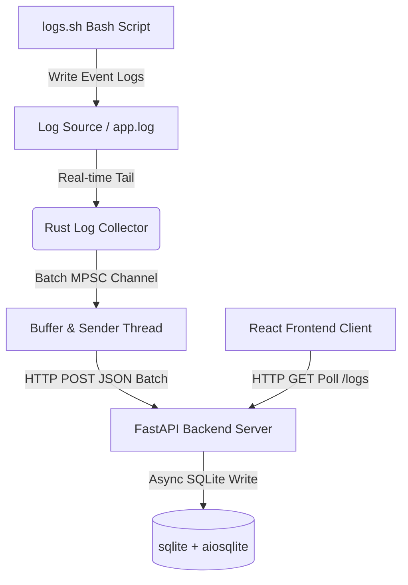

# Log Analyzer 🚀

A high-performance, real-time log ingestion, processing, and visualization system. The project features a resilient Rust-based log collector, an asynchronous FastAPI backend backed by SQLite, and a modern, high-fidelity React dashboard for live log visualization and filtering.

---

## 🏗️ System Architecture

The application is built using a multi-service architecture designed for high throughput, minimal overhead, and system resilience:



1. **Log Simulation (`logs.sh`)**: A utility shell script that generates simulated, timestamped log messages and appends them to a target log file (`app.log`).
2. **Log Collector (Rust)**:
   - **Reader Thread**: Tail-reads the log file in real time. If no new logs are detected, it sleeps for a brief duration (`500ms`) and resumes, avoiding busy-waiting.
   - **MPSC Channel**: Forwards read logs to a separate sender thread, decoupling file I/O from network operations.
   - **Sender Thread**: Buffers log events in memory and flushes them to the API server in batches (when the buffer reaches `1000` logs or `1 second` has elapsed). Features robust connection-error handling with `3 retries` and `500ms` exponential backoff.
3. **API Backend (FastAPI + SQLite)**:
   - Built on `FastAPI` with an asynchronous runtime using `SQLAlchemy` and `aiosqlite`.
   - Protects SQLite parameter limits (max 999 variables) by chunking large incoming batches to safe chunks of `400` objects per batch query.
4. **Frontend Dashboard (React + Vite)**:
   - A dark-themed terminal UI that polls the backend every `500ms` to fetch new logs.
   - Automatically detects log levels (`INFO`, `WARN`, `ERROR`, `DEBUG`) based on log messages and applies appropriate visual tags, search-style filters, and glowing edge-accents.

---

## 🛠️ Tech Stack

* **Frontend**: React 19, Vite, Axios, Pure CSS Grid/Flexbox
* **API Backend**: Python 3.12+, FastAPI, SQLAlchemy (Async), AioSqlite, Uvicorn
* **Log Collector**: Rust (Edition 2024), Reqwest (blocking, JSON features), Serde
* **Environment Management**: `uv` (Python package manager), `cargo` (Rust build system), `npm` (Node package manager)

---

## 📁 Repository Structure

```text
log_analyzer/
├── api/                  # Python FastAPI backend
│   ├── db.py             # Database session setup and SQLAlchemy models
│   ├── main.py           # FastAPI routes & lifespan handlers
│   ├── model.py          # Pydantic schemas for request payloads
│   ├── pyproject.toml    # Project dependencies & python requirements
│   └── uv.lock           # Lockfile managed by uv
├── collector/            # Rust tailing log collector
│   ├── src/
│   │   ├── main.rs       # Setup of threads and channels
│   │   ├── model.rs      # Serializable log message structs
│   │   ├── reader.rs     # app.log tailing implementation
│   │   └── sender.rs     # Buffering, batching & retry sender logic
│   ├── app.log           # Active log file target
│   ├── logs.sh           # Log simulation bash script
│   └── Cargo.toml        # Rust project dependencies configuration
└── frontend/             # Vite + React Log Visualizer
    ├── src/
    │   ├── App.jsx       # Log viewer dashboard & parser logic
    │   ├── App.css       # Clean dark-mode layout and animations
    │   └── main.jsx      # React entrypoint
    ├── index.html        # Main template
    └── package.json      # Node.js configurations
```

---

## 🚀 Getting Started

To get the complete system running locally, follow these steps in order.

### Prerequisites
Make sure you have the following installed on your system:
- **Python** (version 3.12 or newer) and [uv](https://github.com/astral-sh/uv) (recommended)
- **Rust & Cargo** (v1.80+ or latest stable)
- **Node.js** (v18+ or latest LTS) & **npm**

---

### Step 1: Start the API Backend

Navigate to the `api/` directory, set up your environment, and start the server:

```bash
# Navigate to the API folder
cd api

# Install dependencies and sync virtual environment using uv
uv sync

# Run the backend using the virtual environment
uv run python main.py
```
> [!NOTE]
> The database will be automatically initialized and created as `logs.db` within the `api/` directory during startup. The API server will run at `http://localhost:8000`.

---

### Step 2: Start the Frontend Client

Open a new terminal window, navigate to the `frontend/` directory, install dependencies, and launch the development server:

```bash
# Navigate to the frontend folder
cd frontend

# Install package dependencies
npm install

# Start the Vite development server
npm run dev
```
> [!TIP]
> The frontend application will be hosted at `http://localhost:5173`. Open this URL in your web browser.

---

### Step 3: Run the Log Generator and Collector

The Rust collector expects `app.log` to exist. Before launching the collector, generate mock logs using the provided helper shell script, then compile and run the collector.

Open a third terminal window:

```bash
# Navigate to the collector folder
cd collector

# Optional: Generate 150 simulated logs to create the 'app.log' file
./logs.sh 1 150

# Compile and run the Rust collector in release mode
cargo run --release
```

To continuously feed logs into the system while it's running, you can run the shell script again in another terminal window or background process:
```bash
# Run log simulation for logs 150 to 500
./logs.sh 150 500
```

---

## 📡 API Reference

### Get Logs
* **Endpoint**: `GET /logs`
* **Description**: Retrieves all ingested logs from the database.
* **Response**: `Array` of string log messages.
  ```json
  [
    "2026-06-26 09:47:00.123 - Log 1",
    "2026-06-26 09:47:02.124 - [ERROR]: Failed to connect to server"
  ]
  ```

### Post Logs
* **Endpoint**: `POST /logs`
* **Description**: Ingests a list of log messages.
* **Payload**:
  ```json
  [
    { "message": "2026-06-26 09:48:00.000 - Log 1" },
    { "message": "2026-06-26 09:48:01.000 - [WARN]: Connection latency is high" }
  ]
  ```
* **Response**:
  ```json
  {
    "status": "success",
    "inserted": 2
  }
  ```

---

## 🔒 Performance & Reliability Design Decisions

* **Rust Multi-Threaded Model**: Decoupled log reading from HTTP transmitting. The reading thread can tail logs uninterrupted by internet latency, database locks, or network congestion.
* **Microsecond-Precision & Decoupling**: Logs written to the log file via `logs.sh` sleep for configured microsecond intervals (using standard Perl scripting for system compatibility), and the collector tails and buffers them.
* **SQLite parameter limits**: The database model handles bulk insertions with variable parameter safety. Python's SQLite driver throws errors if queries contain >999 parameters. The endpoint chunks operations to 400 entries max per SQL query context.
* **Visual Log Level Parser**: The React frontend uses an intuitive regex matcher (`/^\[?(INFO|WARN|ERROR|DEBUG)\]?\s*:/i`) to strip prefixes, automatically parse severity levels, filter logs dynamically in the state context, and apply specialized CSS glow rings on critical logs.
